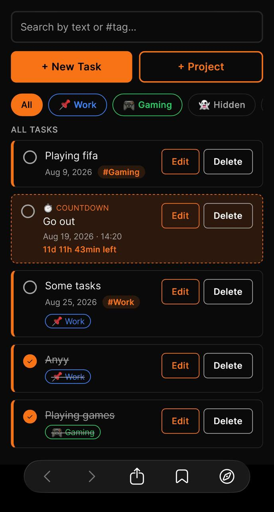

# 🟠 Taskly

**A task manager that grew way past "just another todo app."**

Taskly started as a plain HTML/CSS/JS button with a click handler. It ended up as a full React app with projects, live countdowns, a personal dashboard, and a black-and-orange aesthetic that doesn't look like every other tutorial todo list on the internet. This README walks through what it does, how it's built, and why a few things were built the way they were.

---

## 📸 Screenshots

### Creating, editing, and organizing tasks
<p float="left">
  
  
</p>

The core loop of the app, in two screens: adding a task through the **"+ New Task"** modal (with an optional date, tag, and Standard/Countdown type), editing an existing one, assigning it to a **workspace**, and tapping the small circle to mark it complete — which strikes the text through and dims it rather than deleting it outright. This is also where the color-coded project tabs and search bar live, letting you jump between "All," a specific project, or filter by typing.

### ☰ Navigation drawer


Tapping the orange ☰ button in the top-left opens the app's navigation drawer: **Dashboard** (jumps to the stats overview below), **Projects** (expands into an animated, one-by-one list of every workspace with its own completion percentage), **All tasks**, and **Done** — a dedicated view collecting every completed task across every project in one place.

### 📊 Dashboard


A live snapshot of everything happening across the app: total tasks, how many are completed, your overall completion rate, how many active projects you're running, how many countdown tasks are still ticking, and what's due today. Nothing here is stored separately — every number is calculated fresh from your actual task list each time you open it, so it's never stale.

---

## ✨ Features

**The basics, done properly**
- Create, edit, complete, and delete tasks
- Optional `#tags` on every task, with live search that matches partial text as you type
- Tasks always sort themselves by nearest due date — no manual reordering needed

**Workspaces (projects)**
- Group tasks into named workspaces — each with its own emoji/icon and a color pulled from a curated palette
- Color-code a whole project and everything about it (its tab, its name badge) stays visually consistent
- Mark a workspace **hidden** to keep it tucked away from "All," reachable only through a dedicated 👻 menu

**Countdown tasks**
- A second task type beyond the standard checklist item — give it a date *and* a time, and it counts down live: `2h 14min left`, `3d 6h left`, `1y 2mo left`
- Updates every second, no page refresh required

**A dashboard, not just a list**
- Total tasks, completion rate, active projects, running countdowns, and what's due today — all computed live from your actual data, never stale
- A slide-out menu (☰) ties it all together: Dashboard, Projects (with per-project completion %), All Tasks, and a dedicated Done view

**Built mobile-first**
- Every layout decision started at phone width and scaled up, not the other way around
- Labeled, custom-styled date/time pickers that stay legible across wildly inconsistent mobile browser rendering

**Private by design**
- Everything lives in the browser's `localStorage` — no account, no server, no data ever leaving the device
- Refresh the page, close the tab, come back tomorrow — your tasks are still there

---

## 🛠 Tech Stack

| Layer | Choice |
|---|---|
| UI library | React (function components + hooks — no class components) |
| Styling | Tailwind CSS v4 |
| Build tool | Vite |
| Persistence | Browser `localStorage` (no backend, no database) |
| Fonts | Fraunces (display) + Inter (body) |

No state management library, no CSS-in-JS, no backend. Everything the app needs lives in a handful of `useState` hooks inside one well-organized component tree — proof that you don't always need to reach for extra tooling to build something that *feels* substantial.

---

## 🚀 Getting Started

```bash
npm install
npm run dev
```

Then open the local URL Vite prints in your terminal. That's it — no environment variables, no API keys, no database to spin up.

```bash
npm run build     # production build
npm run preview   # preview that production build locally
```

---

## 📁 Project Structure

```
├── index.html          # Vite's entry point — just a <div id="root">
├── screenshots/         # images used in this README
├── src/
│   ├── main.jsx         # mounts <App /> into the page
│   ├── App.jsx           # currently just renders <TodoApp />
│   ├── TodoApp.jsx       # the entire app: state, logic, and UI
│   └── index.css         # Tailwind import + the black/orange theme tokens
├── package.json
└── vite.config.js
```

Deliberately flat. `TodoApp.jsx` is a big file, but it's organized into clearly commented sections — state, helpers, core operations, workspace operations, modal logic, and render — so "big" doesn't mean "disorganized."

---

## 🧠 A few design decisions worth knowing about

**Todos and workspaces are linked, not nested.** A task doesn't live *inside* a project object — instead, each task just stores a `workspaceId` pointing at its project (or `null` for a general task). This keeps the two concerns completely decoupled: deleting a task never has to know workspaces exist, and deleting a workspace is just filtering out anything that points at it.

**State changes, the UI just... updates.** There's no manual "re-render the list" function anywhere. Every interaction — adding a task, toggling complete, switching a tab — calls a state setter, and React handles redrawing whatever changed. That's the whole mental model for how the app works, end to end.

**A few real bugs got fixed along the way**, not just features added:
- A stacking-order bug where one modal could open *underneath* another and look like it "didn't open" — fixed with explicit `z-index` layering
- A state-timing bug where toggling a workspace's visibility *after* adding its first task silently did nothing, because it was updating a draft value nobody was reading anymore
- Mobile browsers that render literally nothing inside an empty date/time input — worked around with custom labels and placeholders instead of depending on inconsistent native rendering

---

## 🗺 Roadmap

- [ ] **PWA support** — installable on mobile/desktop, works offline, opens as its own standalone app (next up)
- [ ] Export/import your data as a JSON backup
- [ ] Accessibility pass — focus trapping in modals, `Escape` to close, full keyboard navigation
- [ ] Drag-to-reorder tasks within a project

---

## 📄 License

MIT — do whatever you'd like with it.