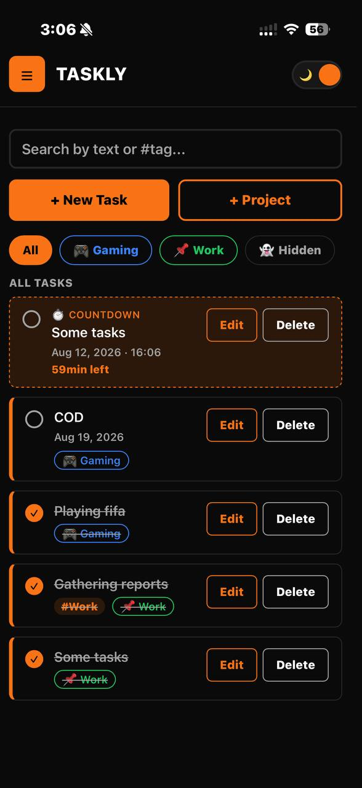
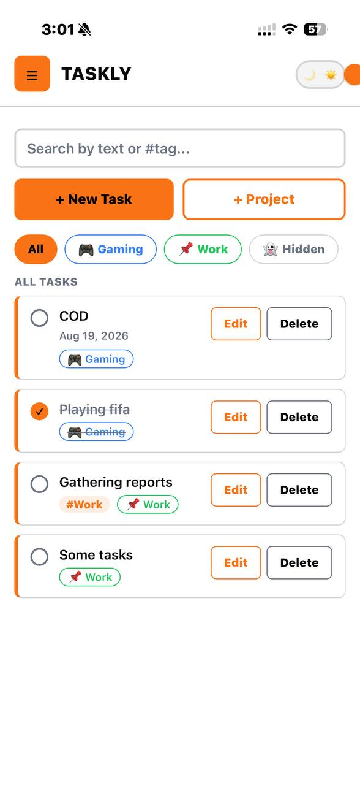
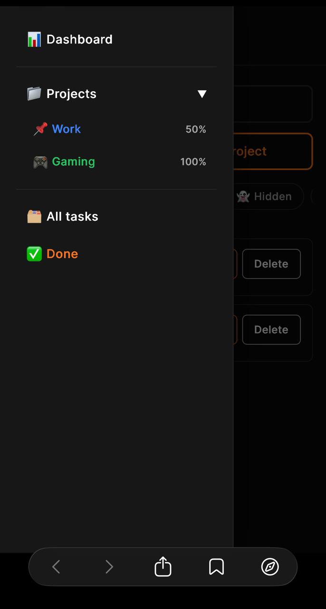
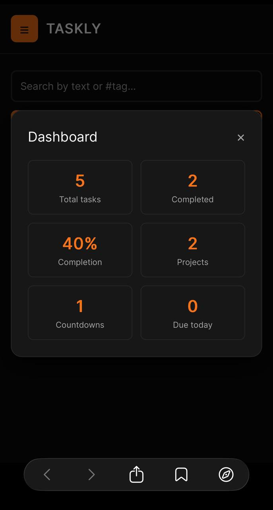
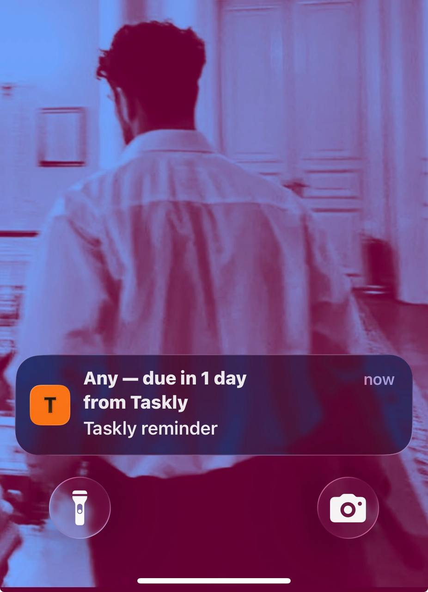

# 🟠 Taskly

**A task manager that grew way past "just another todo app."**

Taskly started as a plain HTML/CSS/JS button with a click handler. It's now a full React app with projects, live countdowns, a personal dashboard, push-style reminders, an installable offline app experience, and a light/dark theme — built entirely without a backend. This README walks through what it does, how it's built, and why a few things were built the way they were.

---

## 📸 Screenshots

### Creating, editing, and organizing tasks
<p float="left">
  
  
</p>

The core loop of the app, in two screens: adding a task through the **"+ New Task"** modal (with an optional date, tag, and Standard/Countdown type), editing an existing one, assigning it to a **workspace**, and tapping the small circle to mark it complete — which strikes the text through and dims it rather than deleting it outright.

### ☰ Navigation drawer


Tapping the orange ☰ button opens the app's navigation drawer: **Dashboard**, **Projects** (an animated, one-by-one list of every workspace with its own completion percentage), **All tasks**, and **Done** — a dedicated view collecting every completed task across every project.

### 📊 Dashboard


A live snapshot of everything happening across the app — computed fresh from your actual task list every time you open it, never stale.

### 🔔 Notifications


A real device notification, fired automatically ahead of a countdown task's deadline — no setup required beyond a single permission tap.

---

## ✨ Features

**The basics, done properly**
- Create, edit, complete, and delete tasks
- Optional `#tags` on every task, with live search that matches partial text as you type
- Tasks always sort themselves by nearest due date — no manual reordering needed

**Workspaces (projects)**
- Group tasks into named workspaces — each with an optional emoji icon (letters and numbers are rejected as you type, so it can never hold plain text) and a color pulled from a curated palette
- Color-code a whole project — its tab, its name badge — stays visually consistent everywhere it appears
- Mark a workspace **hidden** to keep it tucked away from "All," reachable only through a dedicated 👻 menu
- A settings panel to rename, recolor, re-hide, or delete any workspace — and edit or delete the tasks inside it — from one place

**Countdown tasks**
- A second task type beyond the standard checklist item — give it a date *and* a time, and it counts down live: `2h 14min left`, `3d 6h left`, `1y 2mo left`
- Updates every second, no page refresh required

**Reminders**
- Automatic notifications **1 day** and **1 hour** before a countdown task is due — no manual scheduling
- Fires while Taskly is open or running in the background; it does not wake the app from a fully closed state, since that would require a backend push server, which this app deliberately doesn't have

**A dashboard, not just a list**
- Total tasks, completion rate, active projects, running countdowns, and what's due today — all computed live, never stale
- Reached instantly via the slide-out ☰ menu, alongside Projects, All Tasks, and a dedicated Done view

**Light & dark themes**
- A sliding toggle switch, top-right, flips the entire app between a black/orange dark theme and a white/black light theme
- Defaults to matching the device's own light/dark setting on first launch, then remembers whatever's explicitly chosen
- Selectable right from the welcome screen on first open

**Installable, offline-capable PWA**
- Add it to your home screen and it opens as its own standalone app — no browser address bar, no tabs
- Works fully offline once installed, via a service worker caching the app shell
- Custom app icon, splash background, and safe-area-aware layout so the header never sits underneath a phone's notch or status bar

**Built mobile-first**
- Every layout decision started at phone width and scaled up, not the other way around
- Custom-styled date/time pickers that stay legible and correctly sized across wildly inconsistent mobile browser rendering
- Tap targets tuned to avoid the page-zoom and double-tap delays that make web apps feel like web apps instead of native ones

**Private by design**
- Everything lives in the browser's `localStorage` — no account, no server, no data ever leaving the device
- Refresh the page, close the tab, come back tomorrow — your tasks, projects, and theme choice are all still there

---

## 🛠 Tech Stack

| Layer | Choice |
|---|---|
| UI library | React (function components + hooks — no class components) |
| Styling | Tailwind CSS v4 |
| Build tool | Vite |
| PWA | `vite-plugin-pwa` (manifest + service worker generation) |
| Persistence | Browser `localStorage` (no backend, no database) |
| Notifications | Web Notifications API |
| Hosting | Firebase Hosting (static site, HTTPS by default) |
| Fonts | Fraunces (display) + Inter (body) |

No state management library, no CSS-in-JS, no backend. Everything the app needs lives in a handful of custom hooks — proof that you don't always need extra tooling to build something that *feels* substantial.

---

## 🚀 Getting Started

```bash
npm install
npm run dev
```

Then open the local URL Vite prints in your terminal.


---

## 📁 Project Structure

```
├── index.html            # Vite entry + PWA meta tags
├── vite.config.js        # PWA plugin config (manifest, icons, service worker)
├── public/                # app icons
├── screenshots/           # images used in this README
└── src/
    ├── main.jsx            # mounts <TodoApp />
    ├── index.css           # Tailwind import, theme tokens (dark + light), touch/zoom fixes
    ├── TodoApp.jsx         # composition root: layout, navigation state, wiring
    ├── constants.js        # WORKSPACE_COLORS, TASK_TYPES
    ├── utils/               # pure functions — no React, no state
    │   ├── date.js, validation.js, selectors.js, storage.js, notifications.js
    ├── hooks/               # stateful logic, reusable across components
    │   ├── useTaskly.js, useNow.js, useTaskForm.js, useReminders.js, useTheme.js
    └── components/
        ├── TaskItem.jsx, WorkspaceTabs.jsx, Sidebar.jsx
        ├── ui/               # shared building blocks (buttons, fields, Modal shell)
        └── modals/           # one file per modal — New Task, Project, Edit, Dashboard, Settings, Welcome
```

Refactored from a single 1,300-line file into this layered structure: `utils` never depends on `hooks`, and `hooks` never depend on `components` — so logic stays testable and reusable independent of how it's rendered.

---

## 🧠 A few design decisions worth knowing about

**Todos and workspaces are linked, not nested.** Each task stores a `workspaceId` pointing at its project (or `null` for a general task), rather than living inside a project object. Deleting a task never has to know workspaces exist.

**Everything reads from the same theme variables.** Adding a light theme took zero component changes — every color in the app is a CSS custom property (`var(--color-accent)`, etc.), so the light theme is just those same variable names redefined under a `.light` class on `<html>`.

**Notifications are honest about their own limits.** Rather than promising background delivery the app can't provide without a server, the UI plainly states that reminders fire while Taskly is open or backgrounded — not from a fully closed state.

**A few real bugs got fixed along the way**, not just features added:
- A stacking-order bug where one modal could open *underneath* another and look like it "didn't open" — fixed with explicit `z-index` layering
- A state-timing bug where toggling a workspace's visibility *after* adding its first task silently did nothing, because it was updating a draft value nobody was reading anymore
- A button using `translate` for its "pressed" effect that could physically move out from under a finger mid-tap on mobile, causing the tap to miss — replaced with a non-moving brightness change
- The installed PWA's header rendering underneath the phone's status bar — fixed with `env(safe-area-inset-*)`

---


## 📄 License

MIT with an attribution requirement — see [LICENSE](./LICENSE). You're free to use, modify, and deploy this project, but any public use must visibly credit **Drod** as the original creator.